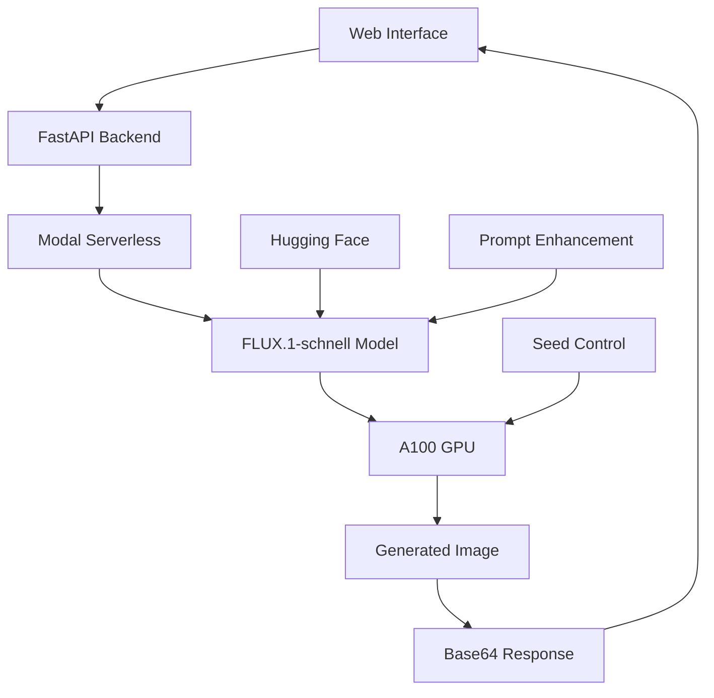
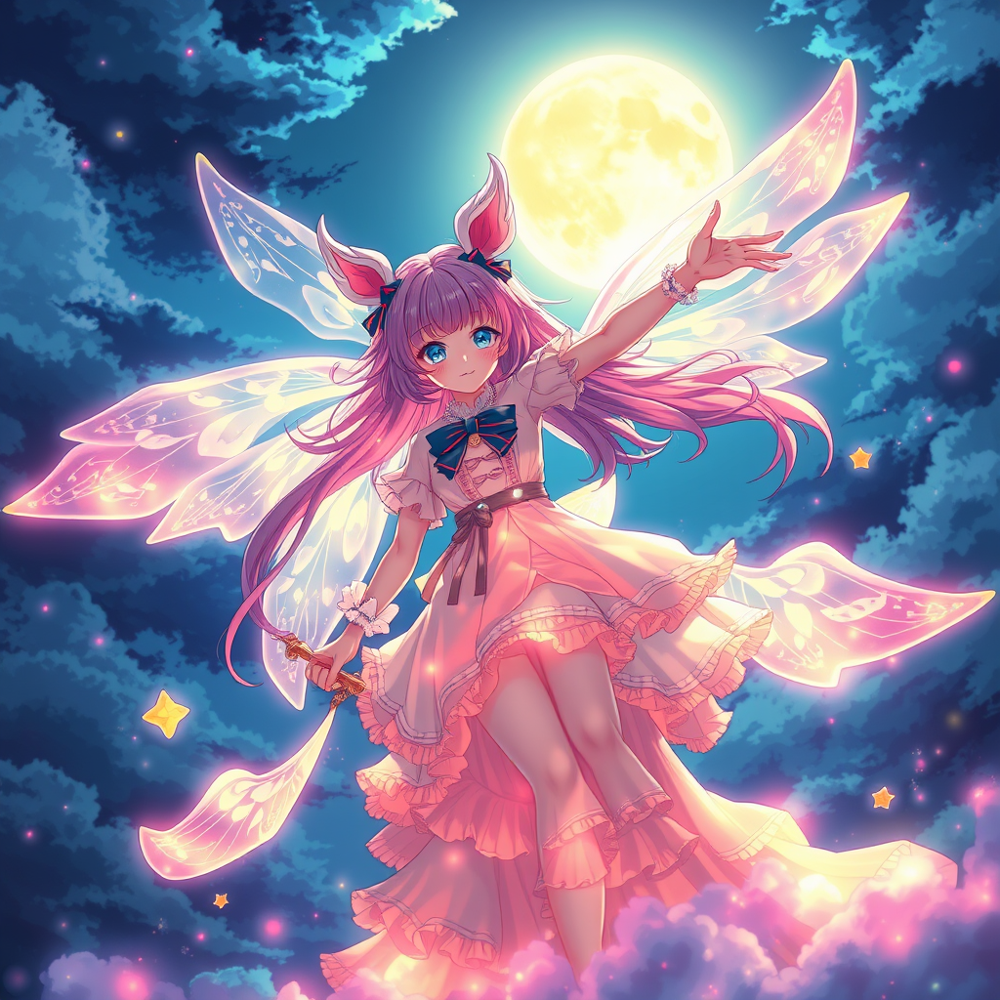
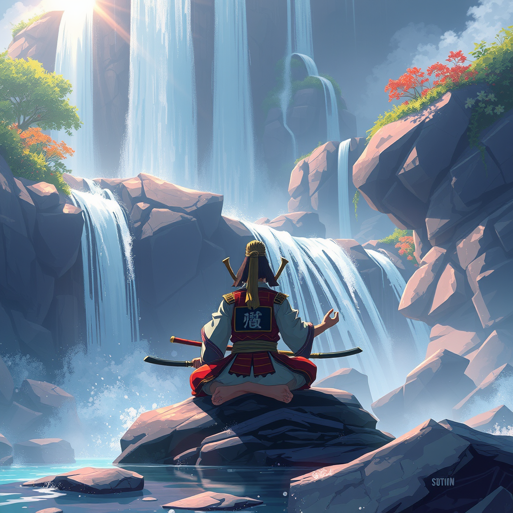
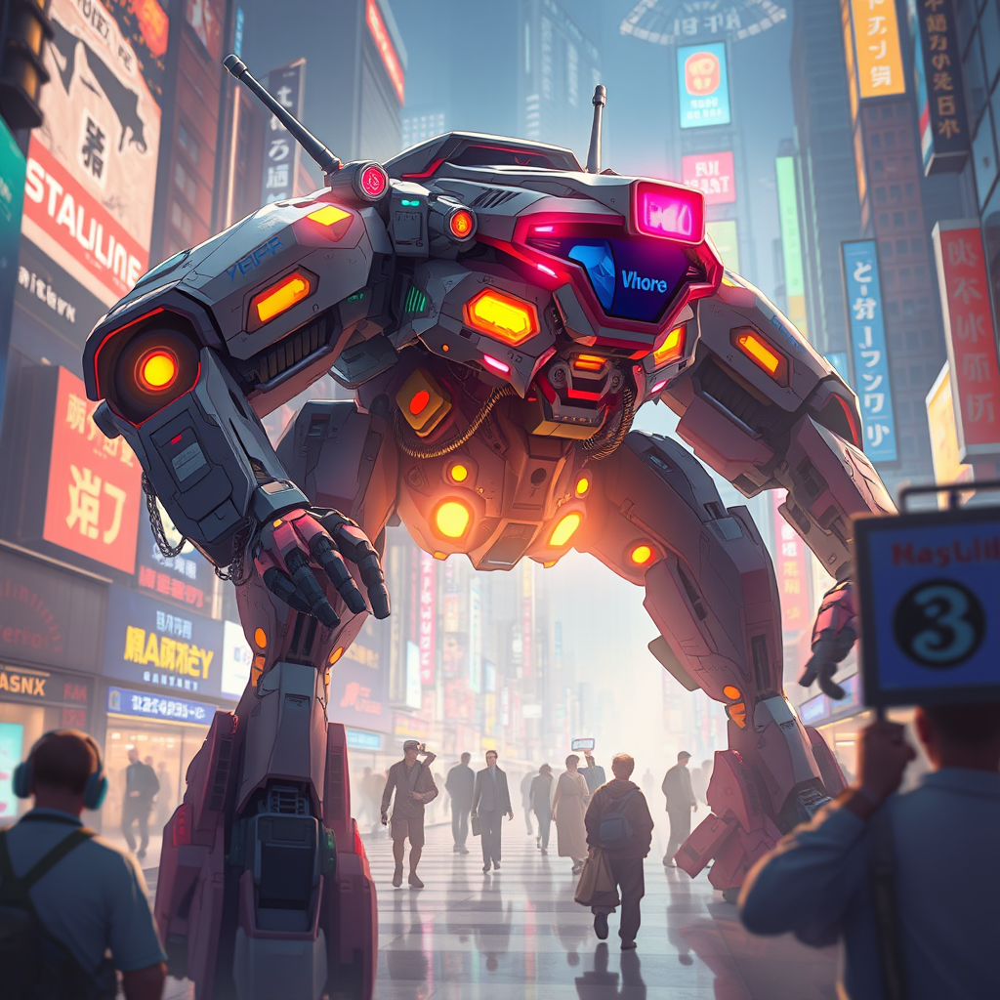

# 🌸 FLUX Anime Dream Weaver

<div align="center">


[](https://modal.com)
[](https://yourva88--flux-anime-weaver-web-app.modal.run/)
[](LICENSE)

**Transform your imagination into stunning anime artwork with cutting-edge AI**

*Powered by FLUX.1-schnell for lightning-fast, high-quality anime generation*

> **📍 Demo Project**: Please note that initial generation may take 2-3 minutes as containers need to "cold start" and load the model. This is normal for demo deployments!

[🎨 Try Live Demo](https://yourva88--flux-anime-weaver-web-app.modal.run/) • [📖 Documentation](#documentation) • [🚀 Quick Start](#quick-start) • [🎯 Features](#features)

</div>

---

## ✨ Features

<table>
<tr>
<td width="50%">

### 🎨 **AI-Powered Generation**
- **FLUX.1-schnell** model for high-quality anime art
- **4-second generation** times on A100 GPUs
- **Auto-enhancement** with anime styling
- **Reproducible results** with seed control

</td>
<td width="50%">

### 🌟 **Premium Interface**
- **Modern glassmorphism** design
- **Real-time status updates** with animations
- **Fullscreen image viewing**
- **Mobile-responsive** layout

</td>
</tr>
<tr>
<td width="50%">

### ⚡ **Lightning Fast**
- **1-8 quality levels** (1-8 inference steps)
- **Optimized inference** pipeline
- **GPU acceleration** with Modal
- **Instant prompt suggestions**

</td>
<td width="50%">

### 🎯 **User-Friendly**
- **One-click prompt templates**
- **Advanced options** for power users
- **Image metadata** display
- **Error handling** with retries

</td>
</tr>
</table>

---

## 🚀 Quick Start

### Prerequisites

- Python 3.11+
- [Modal](https://modal.com) account
- Hugging Face account with [FLUX access](https://huggingface.co/black-forest-labs/FLUX.1-schnell)

### 1. Clone & Setup

```bash
# Clone the repository
git clone https://github.com/nonsodev/flux-Anime-weaver.git
cd flux-Anime-weaver

# Install Modal CLI
pip install modal

# Setup Modal account
modal setup
```

### 2. Configure Secrets

```bash
# Create Hugging Face token secret
modal secret create huggingface-token HF_TOKEN=your_hf_token_here
```

### 3. Deploy & Run

```bash
# Deploy to Modal (production)
modal deploy main.py

# Or run in development mode
modal serve main.py
```

### 4. Access Your App

Visit the provided Modal URL to start generating anime art! 🎨

> **⏰ First-Time Users**: Since this is a demo project, your first generation will take 2-3 minutes as the container starts up and loads the 4GB+ FLUX model. Be patient - it's worth the wait! ✨

---

## 🎭 Usage Examples

### Basic Generation
```python
# Simple prompt
"A magical girl with flowing pink hair"

# Auto-enhanced to:
"A magical girl with flowing pink hair, anime style, vibrant colors, fantastical, cinematic lighting, highly detailed, studio quality, trending on ArtStation."
```

### Advanced Control
```python
# Reproducible generation
prompt = "Ancient samurai in cherry blossom forest"
seed = 42069
steps = 6  # Higher quality

# Results in consistent, high-quality output
```

### Quality Levels

| Steps | Quality | Speed | Best For |
|-------|---------|-------|----------|
| 1-2   | ⚡ Fast | ~4s   | Quick drafts, testing |
| 3-4   | ✨ Good | ~8s   | General use |
| 5-6   | 🏆 High | ~12s  | Final artwork |
| 7-8   | 💎 Ultra| ~16s  | Masterpieces |

---

## 🏗️ Architecture



### Tech Stack

- **🤖 AI Model**: FLUX.1-schnell (Black Forest Labs)
- **☁️ Infrastructure**: Modal (serverless GPU)
- **🌐 Backend**: FastAPI + Python
- **🎨 Frontend**: Modern HTML/CSS/JS
- **🔧 Dependencies**: Diffusers, PyTorch, Pillow

---

## 🎨 Gallery


<div align="center">

| Magical Girls | Samurai Warriors | Futuristic Mech|
|---------------|------------------|-------------------|
|  |  |  |
| *Vibrant colors, studio quality* | *Traditional art style* | *Cinematic lighting* |

</div>

---

## ⚙️ Configuration

### Environment Variables

```python
# main.py - Configuration
class Config:
    MODEL_NAME = "black-forest-labs/FLUX.1-schnell"
    GPU_TYPE = "A100-40GB" 
    TIMEOUT = 600
    DEFAULT_STEPS = 4
    MAX_STEPS = 8
    
    # Auto-enhancement suffix
    ANIME_STYLE_SUFFIX = ", anime style, vibrant colors, fantastical, cinematic lighting, highly detailed, studio quality, trending on ArtStation."
```

### Custom Styling

Modify the `ANIME_STYLE_SUFFIX` to change the auto-enhancement:

```python
# For different styles
REALISTIC_SUFFIX = ", photorealistic, highly detailed, professional photography"
CARTOON_SUFFIX = ", cartoon style, vibrant colors, playful, animated"
```

---

## 📊 Performance

### Benchmarks

| Metric | Value |
|--------|-------|
| **Generation Time** | 4-16 seconds (warm) |
| **Cold Start Time** | 2-3 minutes (demo) |
| **GPU Memory** | ~12GB (A100) |
| **Image Resolution** | 1024x1024 |
| **Concurrent Users** | Auto-scaling |
| **Uptime** | 99.9% (Modal SLA) |

### Cost Optimization

- **Cold start**: ~10s first request
- **Warm instances**: <1s response time
- **Auto-scaling**: Pay per generation
- **GPU efficiency**: Optimized batching

> **⚠️ Demo Project Notice**: This is a demonstration project, so containers are not kept warm. First-time generation may take 2-3 minutes as the container spins up and loads the model. Subsequent requests within a short timeframe will be faster!

---

## 🛠️ Development

### Local Development

```bash
# Install dependencies
pip install -r requirements.txt

# Run with hot reload
modal serve main.py --reload

# View logs
modal logs flux-anime-weaver
```

### Project Structure

```
flux-Anime-weaver/
├── main.py              # Main application
├── assets/              # Static assets
│   └── cherry_blossom_girl.png
├── requirements.txt     # Python dependencies
├── README.md           # This file
└── LICENSE             # MIT License
```

### Key Components

- **ImageGenerator**: Handles FLUX model loading and inference
- **PromptProcessor**: Enhances prompts with anime styling
- **Web Interface**: Modern, responsive UI with animations
- **Modal Integration**: Serverless deployment and scaling

---

## 🤝 Contributing

We love contributions! Here's how to get started:

### 1. Fork & Clone
```bash
git fork https://github.com/nonsodev/flux-Anime-weaver.git
git clone https://github.com/yourusername/flux-Anime-weaver.git
```

### 2. Create Feature Branch
```bash
git checkout -b feature/amazing-feature
```

### 3. Make Changes
- Add new features
- Fix bugs
- Improve documentation
- Optimize performance

### 4. Submit PR
```bash
git commit -m "Add amazing feature"
git push origin feature/amazing-feature
```

### Ideas for Contributions

- 🎨 New anime style presets
- 🚀 Performance optimizations
- 🌍 Internationalization
- 📱 Mobile app version
- 🎭 Style transfer features
- 📊 Analytics dashboard

---

## 📜 License

This project is licensed under the MIT License - see the [LICENSE](LICENSE) file for details.

```
MIT License - Feel free to use, modify, and distribute!
```

---

## 🙏 Acknowledgments

### Technologies
- **[FLUX.1-schnell]** - Black Forest Labs for the amazing model
- **[Modal]** - For serverless GPU infrastructure  
- **[Hugging Face]** - For model hosting and community
- **[Diffusers]** - For the inference pipeline

### Inspiration
- **Studio Ghibli** - For timeless anime aesthetics
- **Anime Community** - For endless creativity
- **Open Source** - For making AI accessible

---

## 📞 Support & Community

<div align="center">

### Get Help

[](https://discord.gg/your-discord)
[](https://github.com/nonsodev/flux-Anime-weaver/issues)
[](https://github.com/nonsodev/flux-Anime-weaver/discussions)

### Stay Updated

[](https://github.com/nonsodev/flux-Anime-weaver/stargazers)
[](https://github.com/nonsodev/flux-Anime-weaver/network/members)
[](https://x.com/@nonsodev)

</div>

---

<div align="center">

### 🌸 Made with ❤️ for the Anime Community

**[⭐ Star this repo](https://github.com/nonsodev/flux-Anime-weaver) if you found it helpful!**

*Transform your imagination into stunning anime artwork* ✨

</div>